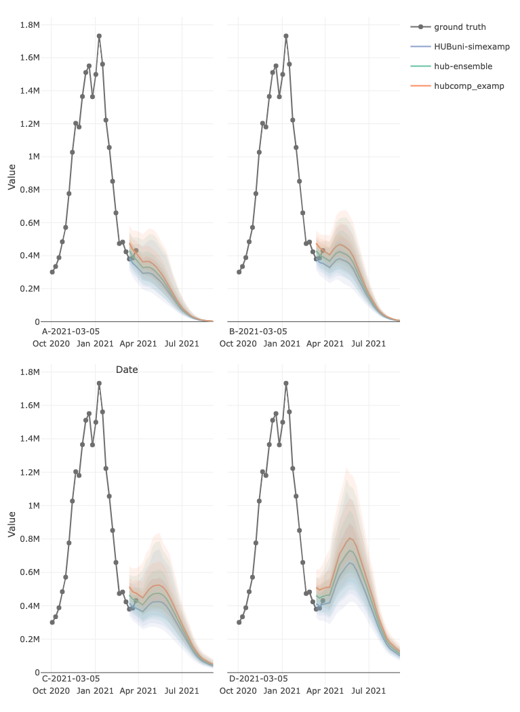

# hubVis

[](https://lifecycle.r-lib.org/articles/stages.html#experimental)
[](https://github.com/Infectious-Disease-Modeling-Hubs/hubVis/actions/workflows/R-CMD-check.yaml)


The goal of hubVis is to provide plotting methods for hub model outputs, 
following the hubverse format. The hubverse is a collection of open-source 
software and data tools, developed by the Consortium of Infectious Disease 
Modeling Hubs. For more information, please consult the 
[hubDocs](https://hubdocs.readthedocs.io/en/latest/) website


## Installation

You can install the development version of hubVis like so:

```r
remotes::install_github("Infectious-Disease-Modeling-Hubs/hubVis")
```

## Usage

The R package contains currently one function `plot_step_ahead_model_output()` 
plotting 50%, 80%, and 95% quantiles intervals, with a specific color per
"model_id".


The function can output 2 types of plots: 

 - interactive (Plotly object)
 - static (ggplot2 object)


> Before plotting, the data might require some preparation (filtering, etc.). 
> These step is skipped in this example, please consult the 
> "Plot Model Projections Output" vignette contained in this package for complete
> examples.

```r
plot_step_ahead_model_output(projection_data_us, truth_data_us)
```


 Faceted plots can be created for multiple scenarios, locations, targets, 
 models, etc.

```r
plot_step_ahead_model_output(projection_data_us, truth_data_us, 
                             use_median_as_point = TRUE,
                             facet = "scenario_id", facet_scales = "free_x", 
                             facet_nrow = 2, facet_title = "bottom left")
```

