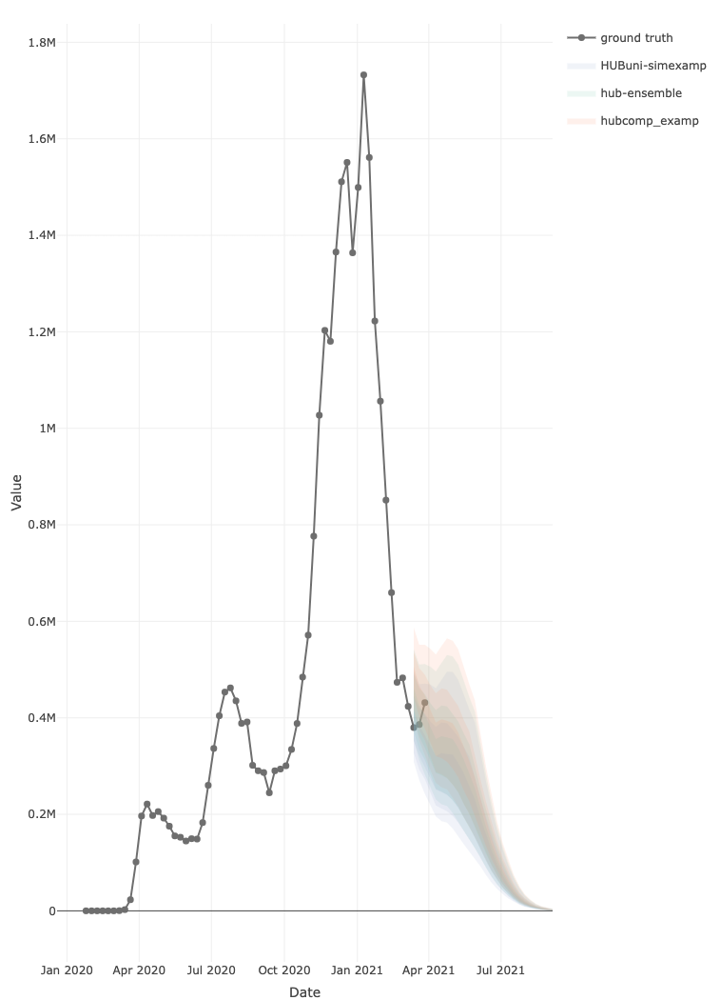

# hubVis <a href="https://infectious-disease-modeling-hubs.github.io/hubVis/"></a>


[](https://lifecycle.r-lib.org/articles/stages.html#experimental)
[](https://github.com/Infectious-Disease-Modeling-Hubs/hubVis/actions/workflows/R-CMD-check.yaml)
[](https://app.codecov.io/gh/Infectious-Disease-Modeling-Hubs/hubVis?branch=main)


The goal of hubVis is to provide plotting methods for hub model outputs, 
following the hubverse format. The hubverse is a collection of open-source 
software and data tools, developed by the Consortium of Infectious Disease 
Modeling Hubs. For more information, please consult the 
[hubDocs](https://hubdocs.readthedocs.io/en/latest/) website


## Installation

You can install the development version of hubVis like so:

```r
remotes::install_github("Infectious-Disease-Modeling-Hubs/hubVis")
```

## Usage

The R package contains currently one function `plot_step_ahead_model_output()` 
plotting 50%, 80%, and 95% quantiles intervals, with a specific color per
"model_id".


The function can output 2 types of plots: 

 - interactive (Plotly object)
 - static (ggplot2 object)

```r
library(hubVis)
```
```r
library(hubExamples)
head(scenario_outputs)
head(scenario_target_ts)
projection_data <- dplyr::mutate(scenario_outputs,
     target_date = as.Date(origin_date) + (horizon * 7) - 1)

target_data_us <- dplyr::filter(scenario_target_ts, location == "US",
                                date < min(projection_data$target_date) + 21,
                                date > "2020-10-01")
```


```r
projection_data_us <- dplyr::filter(projection_data,
                                    scenario_id == "A-2021-03-05",
                                    location == "US")
plot_step_ahead_model_output(projection_data_us, target_data_us)
```


 Faceted plots can be created for multiple scenarios, locations, targets, 
 models, etc.

```r
projection_data_us <- dplyr::filter(projection_data,
                                    location == "US")
plot_step_ahead_model_output(projection_data_us, target_data_us, 
                             use_median_as_point = TRUE,
                             facet = "scenario_id", facet_scales = "free_x", 
                             facet_nrow = 2, facet_title = "bottom left")
```


***

## Code of Conduct

Please note that the hubVis package is released with a [Contributor Code of Conduct](.github/CODE_OF_CONDUCT.md). By contributing to this project, you agree to abide by its terms.

## Contributing

Interested in contributing back to the open-source Hubverse project?
Learn more about how to [get involved in the Hubverse Community](https://hubdocs.readthedocs.io/en/latest/overview/contribute.html) or [how to contribute to the hubVis package](.github/CONTRIBUTING.md).
